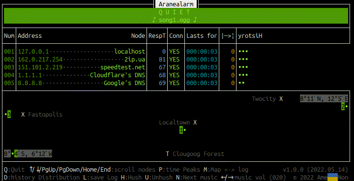
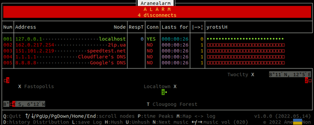
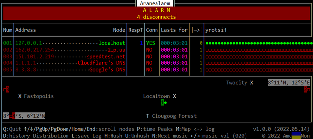

#  Aranealarm

An exercise in basic network monitoring (_aranea_ is "spider[web]" [in Latin](https://www.perseus.tufts.edu/hopper/text?doc=Perseus%3Atext%3A1999.04.0059%3Aentry%3Daranea)) and TUI, this cross-platform Python script pings IP nodes periodically in parallel and displays response time, connection status, some other statistics, and recent history. If all nodes respond to ping, then quiet background music plays. If at least one node becomes disconnected, then music pauses, loud synthesized voice speaks _alarm_ messages, and part of the screen blinks, drawing attention of someone dozing on duty (are you?) until all nodes respond to ping again. When latitude and longitude of nodes and places are given, they are shown on 2D map. Results of each pass are kept in the log, which can be viewed and saved into a file. Configuration is done by means of JSONs.

## Requirements

[Python 3.6+](https://www.python.org/) with [pyttsx3](https://github.com/nateshmbhat/pyttsx3) (voice synth), [pygame](https://pygame.org) (music playback), and, on Windows, [windows-curses](https://pypi.org/project/windows-curses/) (support for `curses` TUI). After Python and `pip` have been installed, those modules can be obtained by

```console
$ pip[3] install -U pyttsx3
$ pip[3] install -U pygame

> pip install -U windows-curses
```

In case of a network disconnected from Internet, that is, where Internet is restricted or downright prohibited, prepared beforehand platform-specific Python installer and wheel files should suffice. With dependencies of the ones above, for instance, on Windows, these wheels are

* `comtypes`

* `pip`

* `pygame`

* `pypiwin32`

* `pyttsx3`

* `pywin32`

* `setuptools`

* `windows_curses`

Having downloaded `pyttsx3-2.90-py3-none-any.whl` and the rest with `> pip download pyttsx3` (or


```console
$ pip[3] download --no-deps --platform win32 --python-version 3.8 windows-curses
```

for environment different from where you run `pip`) where Internet is present, bring them to the monitoring computer, install Python with `pip`, and do `> pip install pyttsx3-2.90-py3-none-any.whl` etc., following the dependency order.

## Usage

List IP nodes that you want to monitor in `ip_nodes_near.json`, `ip_nodes_far.json` etc.; places that you want to see on map in `towns.json`, `forests.json` etc. List these JSONs in `aranealarm.json` along with paths to audio files to be played as background music and few other options.

See `aranealarm.json`, `ip_nodes_pass.json` and `ip_nodes_fail.json`, `places.json` for an example.

Then

```console
$ python[3] aranealarm.py
```

You should see something like this:



Control keys are described at the bottom, use them to e.g. switch from lat-lon map to log of recent passes or add interval between alarm voice messages.

Of course, being a diagnostic tool, Aranealarm only _informs_ you about connection issues and cannot _amend_ them; that is up to something or someone else.

## Binaries

Alternatively, get from [Releases](https://github.com/amenongit/aranealarm/releases) the binary suitable for your OS, copy it to the dir with configuration files mentioned in Usage, and run it.

In this case, on the one hand, you probably avoid troubles from Requirements, but on the other, you cannot modify the script accordingly to _your_ needs.

## Cross-platformity

* On Linux:



* On Windows:



## Extensibility

We consider Aranealarm simple enough so that anyone can add whatever functionality they think it lacks, for instance, checking nodes other than IP ones. Or perhaps they better see

## Sorores et Fratres

There are [many, many such programs](https://en.wikipedia.org/wiki/Comparison_of_network_monitoring_systems), most of them are orders of magnitude more sophisticated than this [ping](https://en.wikipedia.org/wiki/Ping_(networking_utility))-wrapping, wheel-inventing script.

## License

Aranealarm is free software: you can redistribute it and/or modify it under the terms of the GNU General Public License as published by the Free Software Foundation, either version 3 of the License, or (at your option) any later version.

Aranealarm is distributed in the hope that it will be useful, but WITHOUT ANY WARRANTY; without even the implied warranty of MERCHANTABILITY or FITNESS FOR A PARTICULAR PURPOSE. See the GNU General Public License for more details.